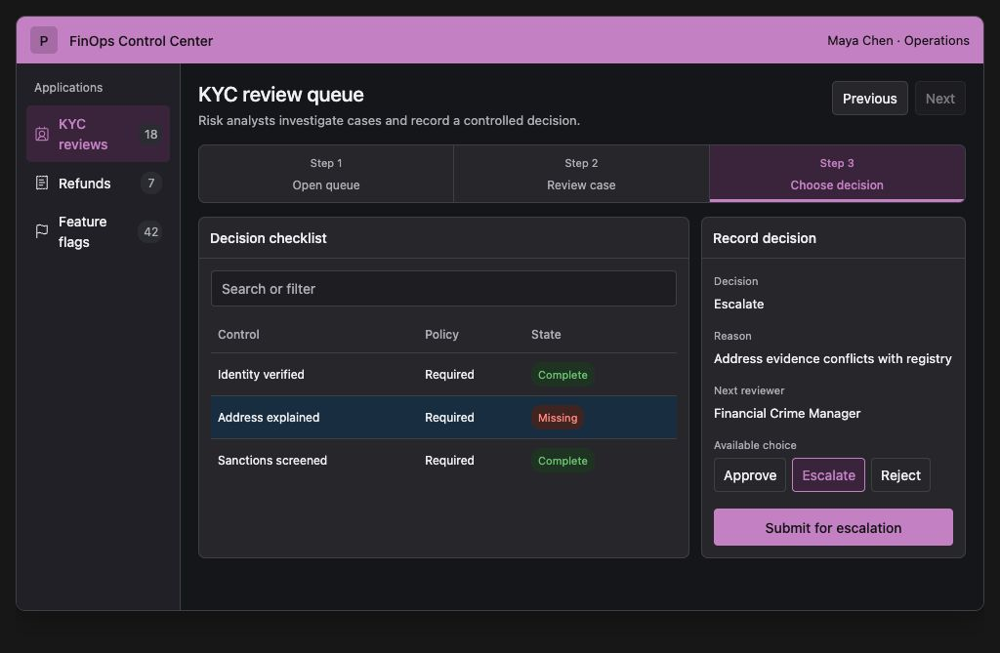
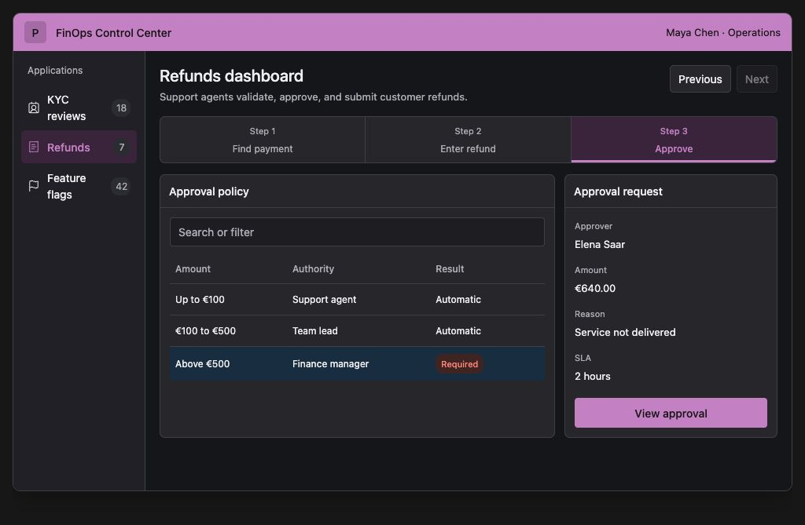
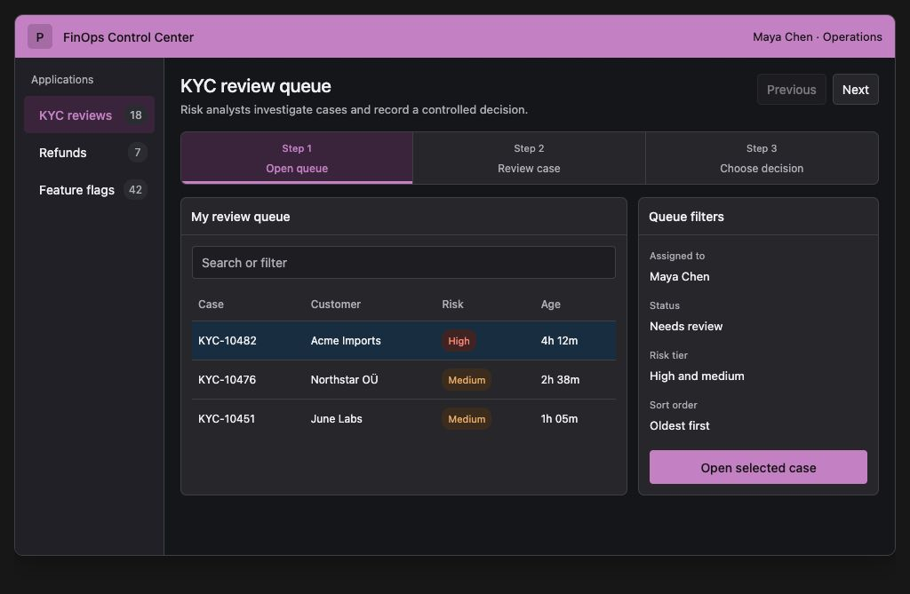
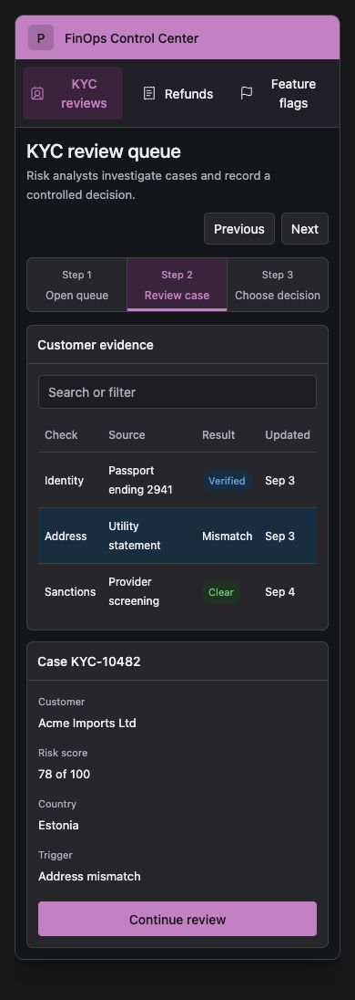

# FinOps Control Center design directions

Status: Production implementation contract  
Scope: KYC reviews, refunds, and feature flags  
Date: 2026-09-04

This contract defines the visible UI. Screenshots set the visual direction. Written measurements and behavior are the acceptance criteria.

## Prototype URLs

- [KYC queue](./prototypes/finops-control-center.html?app=kyc&step=1)
- [KYC decision](./prototypes/finops-control-center.html?app=kyc&step=3)
- [Refund approval](./prototypes/finops-control-center.html?app=refunds&step=3)
- [Feature-flag rollout](./prototypes/finops-control-center.html?app=flags&step=2)

Serve the workspace with `python3 -m http.server 8765`, then open the same paths under `http://localhost:8765/docs/`.

## Short workflow

Keep each tool to three user-facing steps.

| Tool | Step 1 | Step 2 | Step 3 |
|---|---|---|---|
| KYC | Open queue | Review case | Choose decision |
| Refunds | Find payment | Enter refund | Approve |
| Feature flags | Browse flags | Set rollout | Approve production |

Later status appears on the completed record. It is not another workflow step.

## Page anatomy and information order

Every screen uses this order:

1. A 48 px product bar with product name and signed-in user
2. Application navigation for KYC, refunds, and feature flags
3. Page title and one-sentence task description
4. Previous and Next controls
5. Three-step progress control
6. Main table or checklist
7. Selected-record panel
8. One primary action at the bottom of the selected-record panel

Desktop uses a 168 px left navigation rail. The work area uses a 65 to 35 split between the table and the selected-record panel. Do not add summary cards above the work area.

## Screen references

### KYC decision

The checklist stays visible while the analyst chooses Approve, Escalate, or Reject. The action names the result, such as "Submit for escalation."

### Refund approval

The left table explains which approval rule applies. The right panel shows the approver, amount, reason, service level, and next action.

### Feature-flag rollout

The targeting table stays beside the proposed change. Previous value, new value, reason, and ticket appear before "Submit change request."

### Narrow KYC screen

At narrow widths, navigation becomes a horizontal row. The table appears first, followed by the selected record and full-width action.

## Interactions

- Each application and step has a stable URL.
- Previous returns to the prior step. Next advances only when required fields are valid.
- Users may revisit completed steps but cannot skip an incomplete required step.
- Search has a visible label and keeps its value when a record opens.
- Clicking a row selects it and updates the right panel. Enter and Space provide the same selection behavior.
- Forms validate after field exit and on submission. Errors sit below the affected field.
- Leaving a changed form asks the user to keep editing or discard changes.
- Consequential actions show a review state before submission.
- Button labels name the outcome. Avoid generic labels such as "Submit" or "Confirm."

## Required states

- Loading keeps the shell and headings visible and uses skeleton rows.
- Empty explains what is empty and offers one useful action.
- No results repeats the search or filters and offers a clear action.
- Selected uses a row fill plus an accessible selected state.
- Validation shows field messages and an error summary when several fields fail.
- Read only explains why the action is unavailable.
- Changed record blocks submission and offers "Review latest version."
- Failure keeps entered values and places the error beside the failed action.
- Success shows the completed action, record ID, actor, and time.

## Responsive behavior

- At 681 px and above, keep the left rail and two-column work area.
- At 680 px and below, move application navigation under the product bar and stack the panels.
- At 480 px and below, keep three readable step cells. Show the full current step label if a name must be shortened.
- Narrow controls are at least 44 px high.
- Tables wrap values or become labeled record rows. The page never scrolls horizontally.
- At 200 percent zoom, the layout reflows into one column.

## Accessibility

Target WCAG 2.2 AA.

- Each screen has one Heading 1. Panel titles use Heading 2.
- The focus order follows the visible reading order.
- Inputs and icon actions have specific accessible labels.
- Status, risk, selection, and environment never rely on color alone.
- Text contrast is at least 4.5 to 1.
- Focus is visible, at least 2 px thick, and never covered.
- Dynamic validation and completion messages use live announcements.
- Use `TabIndex` 0 for interactive controls and minus 1 for static controls. Do not use positive values.
- Use an accessible table control rather than arranging a Gallery as rows and columns.
- Test with keyboard only, a desktop screen reader, and VoiceOver or TalkBack on the narrow layout.

References: [Microsoft canvas app accessibility](https://learn.microsoft.com/en-us/power-apps/maker/canvas-apps/accessible-apps), [WCAG 2.2](https://www.w3.org/TR/WCAG22/)

## Typography and spacing

Use Segoe UI followed by the system sans-serif. Use weights 400 and 500 only.

| Role | Size and line height |
|---|---|
| Product name | 16 px, 22 px |
| Page title | 21 px, 28 px |
| Panel title | 14 px, 20 px |
| Body and buttons | 13 px, 20 px |
| Table text | 12 px, 18 px |
| Secondary metadata | 11 px, 16 px |

Use a 4 px spacing base. Main increments are 8, 12, 16, 18, 24, and 32 px. Page padding is 18 px on desktop and 12 px on narrow screens. Panel padding and panel gaps are 12 px. Panel radius is 7 px. Control radius is 4 px.

## Color tokens

| Token | Light | Dark |
|---|---|---|
| Page | `#F4F5F7` | `#15161A` |
| Panel | `#FFFFFF` | `#2A2B31` |
| Text | `#242424` | `#F1F1F3` |
| Muted text | `#616161` | `#B6B6BD` |
| Border | `#DEDEE3` | `#484950` |
| Primary purple | `#742774` | `#C98ACC` |
| Soft purple | `#F4E9F5` | `#422844` |
| Row selection | `#E7F3FF` | `#18344B` |
| Success | `#107C10` | `#78C978` |
| Warning | `#8A4600` | `#F1B56F` |
| Danger | `#C42B1C` | `#FF8F85` |

Use text with every status color. Row selection uses blue. Workflow position and primary actions use purple.

## Table density and actions

- Table headers are at least 36 px high.
- Desktop rows are at least 40 px. Narrow rows are at least 48 px.
- Use horizontal dividers only.
- Right-align amounts, percentages, counts, and dates.
- Let names and descriptions wrap to two lines.
- Keep one selected row visible while the user works in the right panel.
- Put one filled primary action at the bottom of the right panel.
- On narrow screens, the action spans the panel width.
- Do not duplicate the primary action in the header, table, or selected row.

## Rejected patterns

- More than three workflow steps
- Explanations of implementation activity inside the product UI
- KPI cards above operational tables
- Modal-first editing for the main task
- Editable tables for decisions or approvals
- Hover-only actions
- Icon-only consequential actions
- Color-only status or selection
- Multiple primary buttons in one panel
- Generic action labels
- Vertical table grid lines
- Page-level horizontal scrolling
- Toast-only errors
- Disabled controls without an explanation
- Nested cards

## Release checks

- All prototype URLs open the correct screen.
- The four screenshots match the implemented anatomy.
- Every screen supports loading, empty, error, read-only, and success states.
- Every primary action names its result.
- Keyboard, screen-reader, contrast, zoom, and narrow-layout checks pass.
